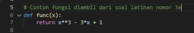
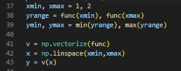
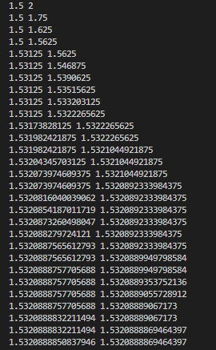
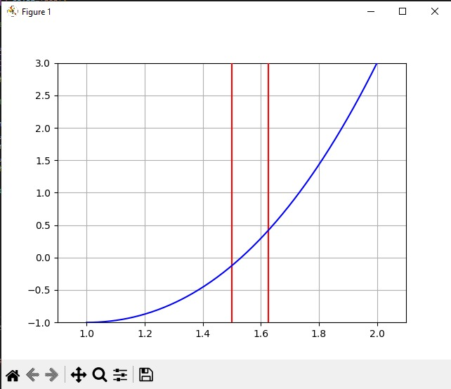

# Bolzano-Bisection-Method

## Praktikum 1 KomNum 2022

### Anggota Kelompok

* Nama : Nadif Mustafa
* NRP : 5025211127

---

* Nama : Frederick Yonatan Susanto
* NRP : 5025211121

---

* Nama : Nizam Hakim Santoso
* NRP : 5025211209

### Dokumen Laporan

Seluruh data dan fungsi kami tulis langsung pada *source code* (*Hard code*), sehingga kami tidak menerima input apapun dari *user*

Setelah program dijalankan, seluruh titik uji akan ditampilkan pada terminal.

Selain itu, akan muncul juga gambar animasi yang menampilkan fungsi f(x) berbentuk kurva, serta titik-titik uji yang direpresentasikan berupa garis vertikal.

